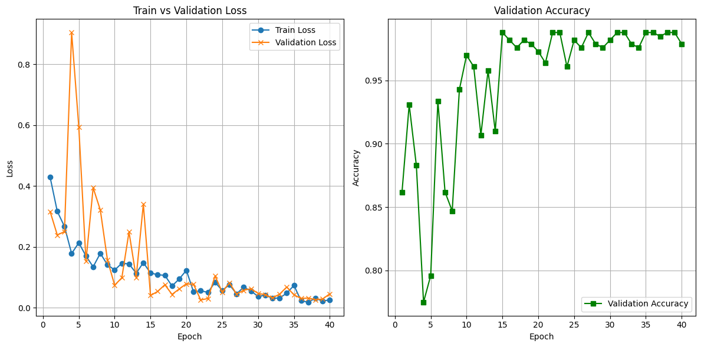

# golf_project

# 프로젝트명
- 🏌️‍♀️ 골프 동작 인식 모델 (YOLO v8 Pose + ST-GCN)

## 🗂 프로젝트 개요
- 문화체육관광부 조사결과 체육활동 중단이유 4위가 금전적 부담, 금전적 여유시 참여희망 종목 1위 골프임.
- 골프는 동작이 중요한 스포츠로, 레슨비(10분당 1만~2.25만원), 장비 및 장소 대여비 등 경제적 장벽이 높음.

## 📋 프로젝트 목적
- 레슨비 부담을 완화할 수 있는 무료 AI 코칭을 목표로 하여 **AI 기반 골프 동작 인식 모델**을 개발함.
- 사용자가 영상을 입력하면: 
  1. 80프레임으로 분할하여 이미지로 변환하고
  2. 'YOLO v8 Pose' 모델로 관절을 인식
  3. 인식된 관절 데이터를 'ST-GCN' 모델에 입력 자세를 분석하여 
  4. **amateur/semipro/pro/legend** 중 하나의 레벨로 분류, 출력함.

## 📈 성과
- **YOLO v8 Pose 모델의 관절 탐지 성능**: mAP50-95(P) 0.898 (크롭 증강 적용 시)
  - 실제 환경 반영 데이터 증강 전략(크롭 3:7)으로 실제 서비스 환경 적용성 개선
- **YOLO v8 Pose 예측 결과를 활용해 원본 데이터에 자동으로 라벨을 생성하는 자체 프로그램** 개발.
  - 수작업 라벨링 대비 데이터 구축 효율과 품질 향상에 기여. (직접 라벨링 시 떨어졌던 둔부 위치 등의 정확도 상승)
  - 1장당 5분 이상 걸렸던 라벨링 시간 검수작업으로 2-3분으로 단축
  - 자동 라벨링 프로그램 코드: `/scripts/labeling_auto.py`
- **ST-GCN 모델**: 관절 시퀀스 기반 골프 동작 레벨 분류에서 2-class 분류 기준 테스트 정확도 97% 달성
  - 총 3,355개(3,334개 AI-Hub + 21개 직접 라벨링) 골프 동작 시퀀스 데이터셋 구축
- Colab Pro 환경에서 코드/데이터/설정 공개로 실험 재현성 확보
- Flask 기반 웹 UI로 실시간 추론 및 결과 시각화 기능 구현

> ※ YOLO로 관절 추출 후 ST-GCN으로 동작 예측하는 전체 파이프라인의 종단(e2e) 정확도는 별도로 수치화하지 않았으며, 데모로 확인 가능 (하단 시연 파트에서 링크 제공)

## 🛠️ 주요 기능 및 기술적 특징
- **YOLO v8 Pose**  
  - 골프 스윙 객체와 배경/캐디/관객을 구분하여 객체 추정  
  - 바운딩박스(객체 위치)와 16개 키포인트(관절 위치) 정밀 추출

- **자동 라벨링 프로그램**  
  - YOLO v8 Pose 예측 결과를 활용해 원본 데이터에 자동 라벨 생성
  - 자동 라벨링 프로그램 도입으로 라벨링 소요 시간 5분 → 2~3분으로 단축(최대 60% 효율 향상)
  - keypoint 좌표 자동 저장/변환 → ST-GCN 학습용 최적화 포맷 출력  
  - 코드 위치: `/scripts/labeling_auto.py`

- **ST-GCN(Spatial Temporal Graph Convolutional Network)**  
  - 프레임별 관절 데이터를 시공간 그래프로 변환  
  - 스윙 동작의 시계열 패턴 분석을 통한 등급 분류  
  - 테스트 정확도 97% 달성(2-class 분류)

- **최종 모델 파이프라인**
  - 영상 입력 시, 자동 라벨링 프로그램이 영상을 80프레임 시퀀스로 분할
  - 각 프레임에서 YOLO v8 Pose로 관절(keypoint) 추출
  - 추출된 시퀀스를 ST-GCN에 입력해 골프 스윙 레벨 자동 분류

- **Flask 기반 웹 UI**
  - 영상 업로드 및 실시간 추론, 결과 시각화, 사용자 피드백 기능 제공
  - 모델의 실제 활용성과 사용자 경험(UX)까지 고려한 엔드투엔드 시스템 구현
  
## 🔧 사용 기술
※ 본 프로젝트는 YOLO v8 Pose, 자동 라벨링 프로그램, ST-GCN 모델을 중심으로 구현되었으며, 각 기술의 역할은 위 기능 설명 참고.

## 🏷 팀 구성 및 역할
- 3인으로 구성 / 총 3주간 진행.
- 조예진 (팀장): 프로젝트 총괄, 전체 모델 설계 및 구현, 데이터 수집 및 전처리, 사용자 화면구현 (Flask).
- 김희원 (팀원): 데이터 전처리, YOLO v8 Pose 모델 학습 및 검증.
- 이명진 (팀원): 데이터 수집 및 전처리, 자동 라벨링 프로그램 구현, ST-GCN 학습.

## 🛠 데이터셋 및 환경
### YOLO V8 Pose
- 데이터셋
  - 데이터 출처: AI-Hub '스포츠 사람 동작 (골프)'
  - 데이터 구성: train (98,093), val (10,765), test (24,158)
  - 어노테이션 포맷: AI-Hub 제공 저작도구 사용
  - 키포인트 개수: 16개
  - 클래스 수: 1개 (사람)
  - 출력: 16개 관절 좌표(x, y, conf) + 바운딩박스(x, y, w, h, conf)
  - 데이터 증강: 원본 이미지와 인물 크롭 이미지를 3:7 비율로 혼합하여 학습 데이터 구성
- 환경  
  - 모델 학습 환경: **Google Colab Pro**
    - 운영체제: Ubuntu (Colab 기본 환경)  
    - Python 버전: 3.10  
    - 주요 라이브러리: ultralytics, opencv, numpy 등  
    - 하드웨어: NVIDIA L4 GPU (VRAM 24GB)
    - 학습 설정: `epochs=100`, `early stopping (patience=10)` → 실제 학습은 88 epoch에서 조기 종료됨
  - 데이터 전처리/학습 검증/예측 환경 (로컬 PC)
    - 운영체제: Windows 11
    - Python 버전: 3.9.12
    - 주요 라이브러리: ultralytics, opencv, numpy 등
    - GPU: NVIDIA GeForce GTX 1660 SUPER
    - CUDA version: 12.1
    - cuDNN version: 90100
- 학습 설정
  - 데이터 전처리:
    - 원본 이미지: 제공받은 상태 그대로 사용(해상도 다양)
    - 크롭 이미지: (960, 560) 크기로 통일하여 정제 후 학습에 활용
  - 배치 사이즈: 16
  - 에폭: 88
  - Optimizer: SGD

### ST-GCN
- 데이터셋
  - 입력 데이터: YOLO에서 추출한 16개 관절 시퀀스
  - 시퀀스 길이: 80프레임
  - 클래스 수: 
  - 1차 학습: 4 class (amateur, semi-pro, pro, legend)
  - 2차 학습: 2 class (amateur, semi-pro+pro+legend)
  - 입력: 16개 관절 시퀀스 (80프레임)
- 시퀀스 개수:
  - AI-Hub: 3,334개
  - 직접 라벨링: 21개
  - 총합: 3,355개
- 데이터 분할:
  - Train: 2,349개 (약 70%)
  - Validation: 503개 (약 15%)
  - Test: 503개 (약 15%)
  - 데이터 전처리: (예시: 정규화, 패딩 등)
- 환경
  - 운영체제: Windows 11
  - Python 버전: 3.9.12
  - 주요 라이브러리: torch, numpy
  - 하드웨어: 
    - GPU: NVIDIA GPU (모델명 미확인)
    - ※ 세부 환경 정보는 프로젝트 완료 후 확인 불가
- 학습 설정
  - 배치 사이즈: 32
  - 에폭: 88
  - Optimizer: Adam
  
- YOLO-pose로 추출한 keypoints를 ST-GCN 입력 포맷([N, C, T, V, M])으로 변환하여, 포즈 추정 결과를 기반으로 레벨을 출력하는 모델을 생성
- 자세한 변환 과정 및 코드는 별도 파일에 첨부 (yolo+stgcn.py 참고)

## 🧪 주요 실험/비교 결과
### 1. 모델 성능 비교
- **YOLO 모델**
  - **실험 결과 비교**
  - mAP50-95(B): 객체 탐지
  - mAP50-95(P): 관절 탐지
| 구분  | 학습 데이터   | 테스트 데이터 | mAP50-95(B)| mAP50-95(P)| 학습 에폭 | 총 학습시간 | 1에폭 평균 |
| ---- | ------------- | ------------ | ----------- | ---------- | -------- | --------- | --------- |
| 1차  | 원본           | 원본         | 0.979       | 0.951      | 88       | 약 23시간  | 약 16분   |
| 1차  | 원본           | 크롭         | 0.954       | 0.831      | 88       | 약 23시간  | 약 16분   |
| 2차  | 원본+크롭(3:7)  | 원본+크롭    | 0.971       | 0.88       | 88       | 약 23시간  | 약 16분   |

  - **성능 개선**: 관절 탐지 정확도 3.3% 향상
  - **학습 환경**: 
    - 총 학습시간: 약 23시간 (88에폭, Colab Pro)
    - 1에폭당 평균: 약 16분 (로컬 GPU 대비 5.6배 개선)
  - **추론 속도**: (별도 측정 필요)
  - 
- **ST-GCN 모델**
  - **데이터 분포**
| 구분    | Set        | 클래스 0       | 클래스 1       | 클래스 2 | 클래스 3 | 전체  |
| ------- | ---------- | -------------- | -------------- | -------- | -------- | ----- |
| **1차** | Train      | 1,183 (50.36%) | 1,166 (49.64%) | -        | -        | 2,349 |
|         | Validation | 240 (47.71%)   | 263 (52.29%)   | -        | -        | 503   |
|         | Test       | 242 (48.11%)   | 261 (51.89%)   | -        | -        | 503   |
| **2차** | Train      | 1,183 (50.36%) | 1,166 (49.64%) | -        | -        | 2,349 |
|         | Validation | 240 (47.71%)   | 263 (52.29%)   | -        | -        | 503   |
|         | Test       | 242 (48.11%)   | 261 (51.89%)   | -        | -        | 503   |
  

  - **실험 결과 비교**
| 구분    | 클래스 수 | Accuracy | Macro F1 | Weighted F1 | 주요 클래스별 F1               | Test 샘플 수 |
| ------- | --------- | -------- | -------- | ----------- | ------------------------------ | ------------ |
| **1차** | 4         | **0.98** | -        | -           | Amateur: 0.9937 Pro: 0.9943 | 503          |
| **2차** | 2         | **0.97** | **0.88** | **0.97**    | Class 0: 0.99 Class 1: 1.00 | 503          |
  - **1차 학습**
      - 정확도/손실 그래프  
      
      - Confusion Matrix  
      
  - **2차 학습**
      - 정확도/손실 그래프  
      
      - Confusion Matrix  
      
  - **2차 실험 상세 결과**
| 클래스      | Precision | Recall | F1-score | Support |
| ----------- | --------- | ------ | -------- | ------- |
| **Class 0** | 0.97      | 1.00   | **0.99** | 242     |
| **Class 1** | 1.00      | 1.00   | **1.00** | 261     |

### 2. 하드웨어별 성능 차이
- ST-GCN은 동일 GPU 환경에서만 실험하였으며, YOLO는 GTX 1660 Super와 Colab Pro에서 실험 결과를 비교함.
- YOLO는 여러 환경에서 실험했고, 각 환경별 문제점과 해결 과정은 [엣지 케이스 대응] 파트 참고.

### 3. 주요 발견사항
- **높은 정확도**: 두 실험 모두 97-98%의 우수한 성능 달성
- **균형적 데이터 분포**: 클래스 간 50:50 비율로 균형적 구성
- **안정적 성능**: 1차, 2차 실험 모두 일관된 고성능 유지
- **실험의 한계**: 데이터셋의 불균형으로 인해 일부 클래스의 학습 데이터가 부족하였으며, 추후 이 부분을 보완하여 추가 학습을 진행한다면 더 높은 성능의 모델 개발이 가능할 것으로 판단

### 🧩 본인 담당 파트
#### 1. 데이터 파이프라인 구축
- **AI-Hub 에서 제공받은 형식에 맞춰 데이터 라벨링**:  
  - 16개 관절 포인트 (16개) + 바운딩박스 라벨링 작업 수행
  - 데이터 품질 및 일관성 유지를 위한 표준화된 라벨링 프로세스 적용

#### 2. YOLO 모델 최적화
- **1차 학습**
  - 데이터: train 80,000 / val 10,000 / test 10,000 (원본 이미지)
  - 테스트: 
    - 원본 test: mAP50-95(P) 0.951
    - 크롭 test: mAP50-95(P) 0.831
  - 해석: 원본과 유사한 구도에서는 높은 성능, 인물이 크게 나온(배경이 잘린) 이미지에서는 성능 저하 확인
- **2차 학습**
  - 데이터: train 98,093 / val 10,765 / test 24,158 (원본:크롭=3:7)
  - 테스트: 원본+크롭 혼합 test, mAP50-95(P) 0.88
  - 해석: 상용화 환경(인물이 크게 나오는 상황) 고려해 데이터 가공 및 학습, 관절 탐지 1차 학습 대비 정확도 3.3% 향상

#### 3. 엣지 케이스 대응
- 학습 환경 및 데이터 압축 해제 문제
  - 1차 시도: 로컬 GPU PC (Anaconda Prompt)
    - 직접 보유한 GPU PC에서 학습 진행
    - 문제: 1에폭당 약 1시간 30분 소요, 학습 속도가 너무 느림
  - 2차 시도: 구글 드라이브 마운트 + Colab에서 압축 해제
    - 구글 드라이브에 압축파일(.zip) 업로드
    - Colab에서 드라이브 마운트 후 !unzip 명령어로 바로 압축 해제
    - 문제: 압축 해제 시 일부 파일이 누락되는 현상 발생
    - 원인: Colab과 구글 드라이브 간 동기화 지연 및 대용량 파일/폴더 구조에서 파일 누락 가능성
    - 결과: 데이터셋이 불완전하게 풀려 학습에 문제 발생
  - 3차 시도: RunPod에서 학습
    - RunPod 환경에서 학습 시도
    - 장점: 빠른 속도, Colab보다 자유로운 환경
    - 단점: 초기 환경 세팅 번거로움, 비용 발생
  - **4차 시도: Colab Pro(유료) + Colab 로컬에 직접 압축 해제**
    - 구글 드라이브에는 압축파일 상태로만 저장
    - 학습 시작 시마다 Colab 로컬(/content/)로 압축파일을 복사한 뒤, 그곳에서 압축 해제
    - 차이점: 드라이브 내에서 바로 압축을 푸는 것이 아니라, Colab의 임시 저장소에서 압축을 풀어 사용
    - 결과: 파일 누락 문제 없이 안정적으로 데이터셋 사용 가능
- 데이터셋 한계 및 다양성 확보
  - 배경 비중이 높은 원본 이미지의 한계를 보완하기 위해 train 데이터 일부를 크롭하여 인물이 더 크게 보이도록 데이터 가공
  - 구도와 배경의 다양성 부족 문제를 해결하고자, 직접 신규 데이터를 수집·라벨링하여 2차 학습 및 테스트에 활용

#### 4. 협업을 위한 표준화
- 데이터 라벨링 자동화
  - 라벨링 작업 효율성 개선을 위해 YOLO Pose 학습 결과를 활용한 자동 라벨링 프로그램 개발
  - (기존 수작업: 1세트 80장 기준 5~6시간 → 자동화로 시간 단축)
- 팀 협업 프로세스
  - 이틀에 한 번씩 각자 진행 상황 및 성과 공유, 보완 회의 진행
  - 구글 드라이브 및 노션을 통한 데이터/진척도 실시간 공유

### 🎥 시연 영상
- 본 프로젝트의 주요 기능 및 동작 과정을 시연한 데모
<video src="./video/demo.mp4" controls width="600"></video>
- Flask 웹 UI 예시는 발표 자료(PPT)에 캡처 포함. 실시간 추론과 결과 시각화 기능을 시연 영상에서 확인 가능.

### 📄 발표 자료
- [노션 발표자료 바로가기](https://www.notion.so/MAIN-1e6de7d9381d8072b69def7f458f073e)
- 발표용 PPT 파일: [golf_project.pptx](./presentation/golf_project.pptx)

### 💡 느낀 점/회고
#### 📝 Facts  
- 데이터셋 다운로드 및 가공, YOLO v8 Pose와 ST-GCN 모델 설계 및 반복 실험, 커스텀 및 성능 평가를 진행함.

#### 😊 Feeling  
- 데이터 다운로드 및 가공이 프로젝트에서 가장 큰 비중을 차지하고 예상보다 많은 시간이 소요됨.  
- 반복 작업 및 재작업이 많아 어려움을 느꼈으나, 끝까지 해결해냈다는 점에서 뿌듯함을 느낌.

#### 🔍 Finding  
- **데이터 품질이 모델 성능에 결정적 영향을 미침을 체감함.**
- 실험 반복과 정확한 설정의 중요성을 깊이 인식함.

#### 🚀 Future Action  
- 실험 기록을 체계화하고, 다양한 모델 구조 실험을 계획함.  
- 데이터 파이프라인 자동화 고도화도 추진할 예정.

#### 💬 Feedback  
- 실무 워크플로우 경험과 협업, 버전 관리의 중요성을 직접 체득함.  
- 데이터 정제와 반복 실험 과정에서 인내심과 문제 해결 능력을 키웠고, 딥러닝 모델 개발에서 학습보다 데이터셋 구축과 정제에 더 많은 시간이 소요된다는 점을 실제로 경험함.  
- 같은 작업을 여러 번 반복하며 문제를 해결해나가는 과정에서 체계적인 문제 해결력과 인내심이 크게 성장함.
